```{r setup, include=FALSE}
knitr::opts_chunk$set(echo = FALSE,message = FALSE,warning = FALSE)
```


# Introduction

In this project, we will use the National Hospital Ambulatory Medical Care Survey (NHAMCS) dataset (2012 - 2016) from the Centers for Disease Control and Prevention official website. Since 1992, the NHAMCS has been conducted every year to collect data on the utilization and provision of ambulatory care services in hospital emergency and outpatient departments. Data are collected including some basic characteristics of patients (such as age, gender, race, and ethnicity), as well as data on initial vital signs (such as patient's temperature, heart rate, systolic blood pressure, pulse oximetry, and so on). In addition, we have a text variable that tells us the reasons for visits and possible causes of disease for each observation. Given these information, we would like to predict whether patients need any medical imaging (including X-ray and CT scan). In this way, doctors are provided with a reference about medical imaging. Hopefully, it could help the novice doctor to make decision about medical imaging or not and arrange medical resources better.   
To predict whether patients need any medical imaging, we would build several classification models. The methods we would use are multilayer perceptron, GloVe and LSTM.


# Datasest
In our project, rather than use all of the data since 1992, we would like to use the data from 2012 to 2016. After data cleaning, we have 27,665 observations in our dataset and around 30.34% of these patients need medical imaging to help the disease diagnosis. So the sample number of need medical imaging over the sample number of not need is roughly 1 over 2.3. It is unbalanced but still tolerable.      
We have two kinds of input data. One type is structure data. Structure data are all numeric or factors, including patient characteristics(age, sex, race, and ethnicity, and so on) and visiting characteristics(temperature, heart rate, systolic blood pressure, pulse oximetry, and so on). For those variables that are factors, we use one-hot embedding to encode them.  From the distribution of some variables, it can been seen that they are quite similar in two groups so that we could not find an apparent tendency. Therefore, a relatively complex model would be more appropriate than a simple model like logistic regression. Take age and painscale as examples.

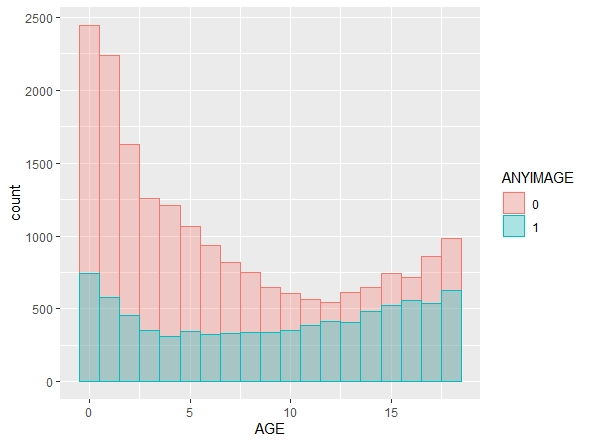


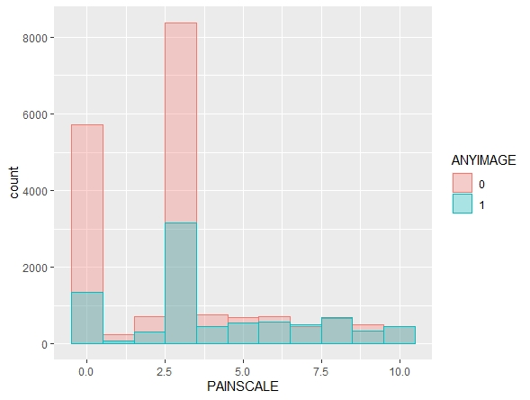


Another type of data is text data. We have reasons for visit and possible causes of disease. For two kind of text variables, we use word clouds to see the frequent words and compare the word usage in two groups.

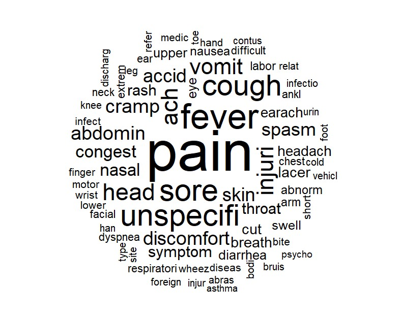

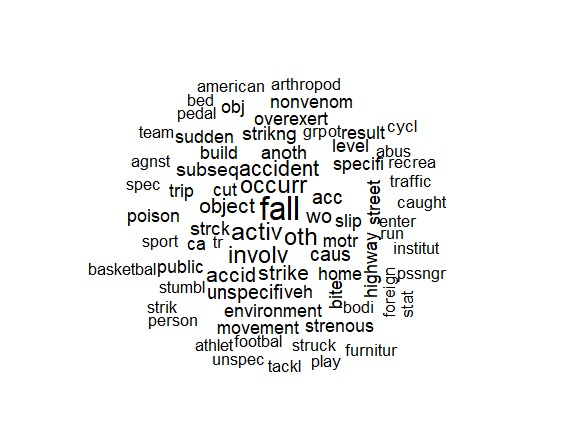

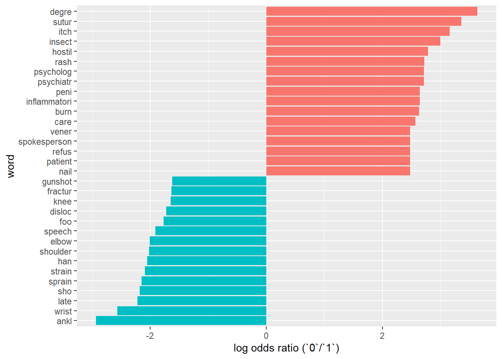

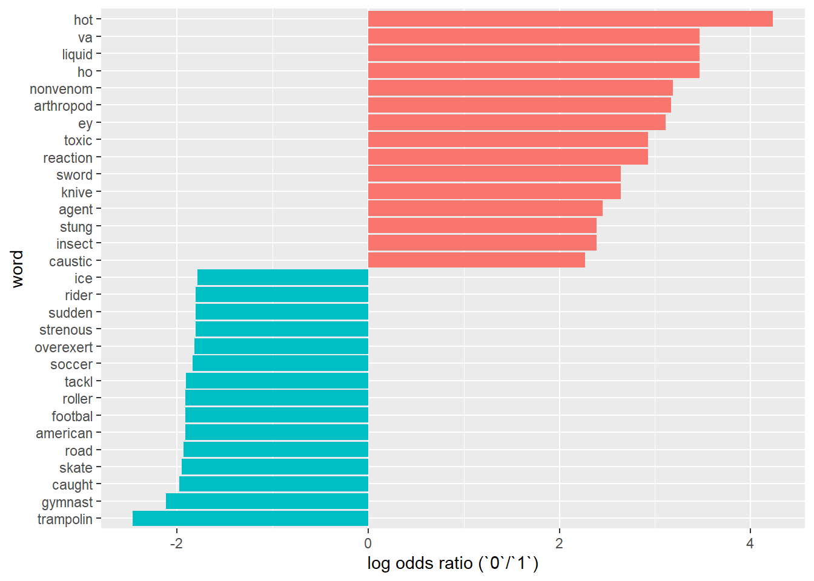


From the plots above, we have a rough understanding of the text variables. For the reason of visiting, the top three most common words are pain, fever, and sore. For the possible causes of disease, the top three most common words are NA, fall and activ. NA means that doctors could not give a explicit answer. Besides, we can know that text inputs are different in two groups. So text inputs would be important variables to predict whether patients need medical imaging or not.

# Methodology

We would use different methods for different types of data. For the structure data, we would use multilayer perception, namely a subset of deep neural networks to do classification. For the text data, we need to numerically represent the text data. Here we apply one of the most commonly-used techniques, GloVe on text input. After getting the word-embedding representation, we would like to use LSTM neutral network model for classification.

## Multilayer perceptron
Here we utilize a relatively simple multilayer perceptron model on the structure data. The structure of our model is an input layer, followed by two dense layer, finally an output dense layer with the output size of two. There are 7,298 parameters in this model and all of them are trainable. 

## Word embedding - GloVe
The simplest word embedding methos is the Bag of Words method, which just split sentences into every single word and get a 'dictionary'. Then it uses one-hot encoding to tell whether the word appears or not. But this kind of method does not show the relationship of words. GloVe is a method that represents one-hot encodings of words into dense vectors which essentially based on one idea: similar word will appear in similar sentence structure. Rather than treat every word as an unique and independent word, GloVe takes the semantic similarity into consideration and uses the co-occurance of words to show word similarity.

## Long short-term memory (LSTM)

Long Short-Term Memory networks are a type of recurrent neural network capable of learning order dependence in sequence prediction problems. Thus, it is widely used in natural language processing problem. An LSTM layer consists of a set of recurrently connected blocks, namely memory blocks. Each memory block contains one or more recurrently connected memory cells and three multiplicative units (the input, output and forget gates).   
The model we used in our project consists of an input layer, an embedding layer, a LSTM layer and a dense output layer. So there are 158,556 parameters, 91,906 of them are trainable while 66,650 are non-trainable parameters.


# Results
We split the dataset into 8:2 for training and testing.  First see the outputs of models using structured and textual variables separately. Then we combine all variables and fit a hybrid deep learning model by concatenating MLP and LSTM. For evaluation, we would use ROC curves to demonstrate the results.

## Structured inputs and MLP
For the training part, we use 10 epochs and set the batch_size as 32. And the best AUC we get is 0.778 in the validation set. Addtionally, we also use other metrics. The accuracy is 0.718, the precision is 0.719 and the recall is 0.716.   
Use the best model in the training part, we get a 0.78 AUC in our testing set. 
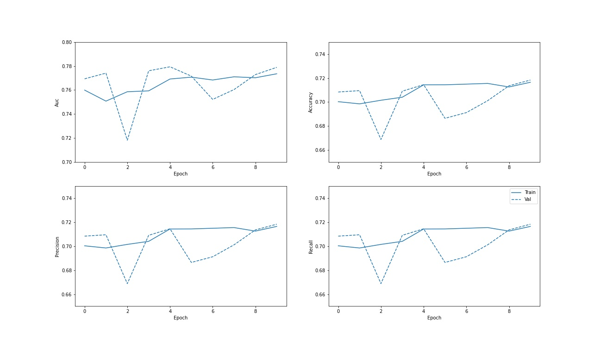


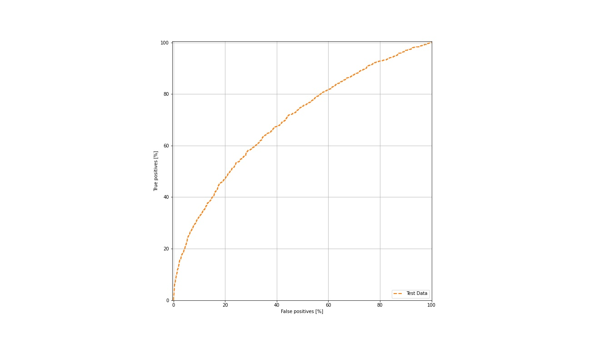


## Text inputs and LSTM
Before training, we need to perform data cleaning. To clean the text data, we remove urls, punctuations, and single letter. Then we remove stop-words - those commonly used words in English such as ”the” ”that” ”is” ”are” that do not construct meaning of the sentence. Finally, we lowercase all letters and remove multiple spaces.
As for the training part, we also use 10 epochs and set the batch_size as 64. In the validation set, the best AUC we get is 0.851. In addtion to this, the accuracy is 0.771, the precision is 0.770 and the recall is 0.771.   
In the testing set, we get a 0.8 AUC using the best trained model.  
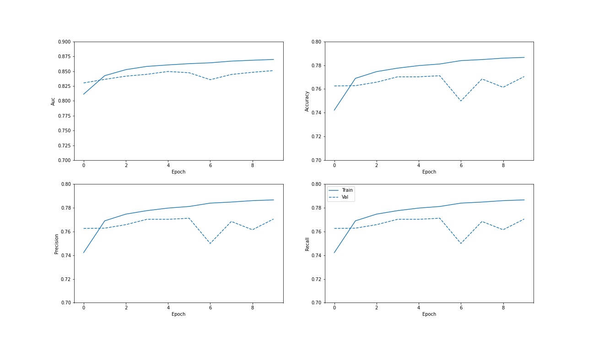


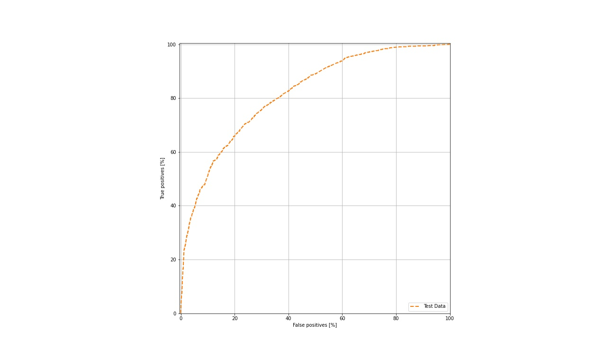

## All inputs and hybrid model
We combine all variables finally to see the results. In the training part, we achieve the auc of 0.856, accuracy of 0.776, precision of 0.776 and recall of 0.776 in the validation set. In the test set, we obtain a 0.865 auc. The performance of hybrid model exceeds the traditional MLP model and the LSTM model.
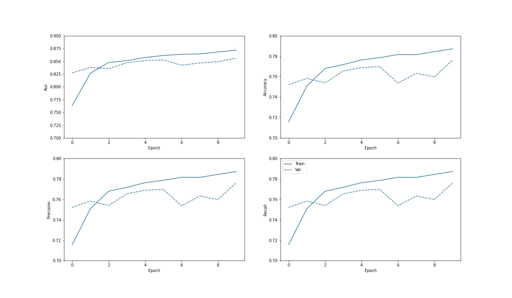


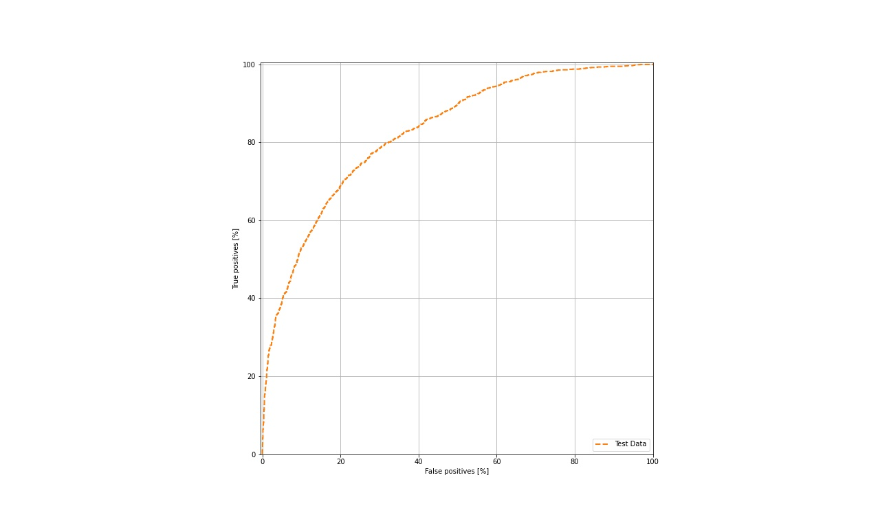


# Discussion
For further improvement, we consider using Bert, a state-of-art method to replace GloVe embedding. Besides, we can also try other algorithms, such as XGBoost, LightGBM and Random Forest.

# Sources and References
1.	Gers, Felix A., Jürgen Schmidhuber, and Fred Cummins. "Learning to forget: Continual prediction with LSTM." (1999): 850-855.
2.	Graves, Alex, and Jürgen Schmidhuber. "Framewise phoneme classification with bidirectional LSTM and other neural network architectures." Neural networks 18.5-6 (2005): 602-610.
